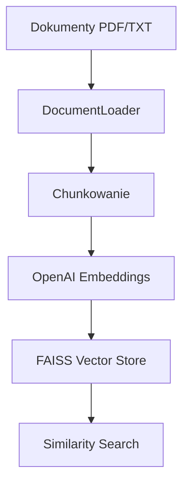
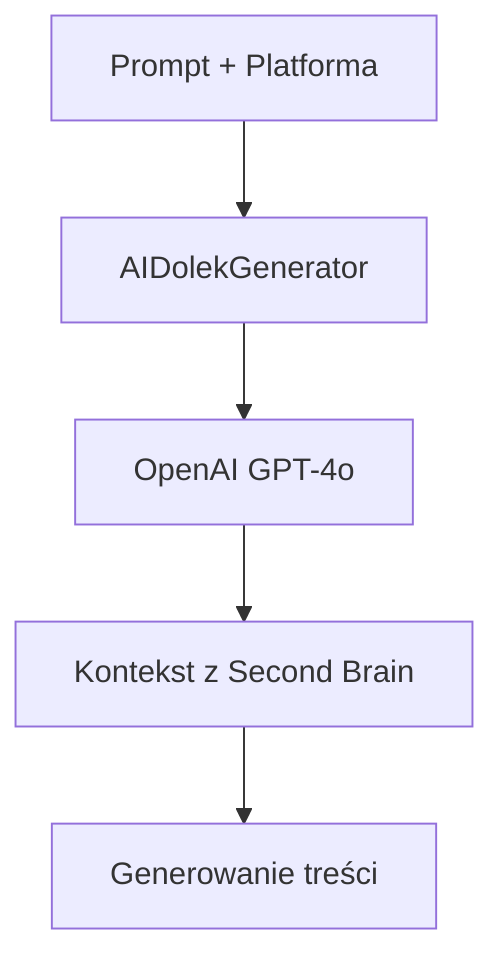

# Second Brain & AIDolek - Dokumentacja

## 📌 Opis
Moduły **Second Brain** i **AIDolek** rozszerzają funkcjonalność projektu `prometeusz` o:
- **Pamięć wektorową** (FAISS + OpenAI Embeddings) do przechowywania i wyszukiwania dokumentów.
- **Generator spersonalizowanych treści** (LinkedIn, email, blog) z kontekstem z pamięci wektorowej.

---

## 🛠️ Second Brain
### Architektura


### API Endpointy
| Endpoint                     | Metoda | Opis                                                                 | Przykład                                                                                     |
|------------------------------|--------|---------------------------------------------------------------------|---------------------------------------------------------------------------------------------|
| `/api/second-brain`          | POST   | Upload dokumentów lub wyszukiwanie podobieństw.                     | `curl -X POST http://localhost:3000/api/second-brain -F "action=upload" -F "files=@plik.pdf"` |
|                              |        | Parametry:                                                           | `curl -X POST http://localhost:3000/api/second-brain -d '{"action": "search", "query": "AI"}'` |
|                              |        | - `action`: `upload` lub `search`                                    |                                                                                             |
|                              |        | - `query`: Zapytanie do wyszukiwania (dla `action=search`)          |                                                                                             |
|                              |        | - `files`: Pliki do uploadu (dla `action=upload`)                    |                                                                                             |

### Przykładowe użycie
```typescript
// Dodanie dokumentów
await VectorStore.addDocuments(["Treść dokumentu"], [{ source: "plik.pdf" }]);

// Wyszukiwanie
const results = await VectorStore.similaritySearch("Zapytanie", 3);
```

---

## 🤖 AIDolek
### Architektura


### API Endpointy
| Endpoint                     | Metoda | Opis                                                                 | Przykład                                                                                     |
|------------------------------|--------|---------------------------------------------------------------------|---------------------------------------------------------------------------------------------|
| `/api/ai-dolek`              | POST   | Generowanie treści na podstawie promptu i kontekstu.               | `curl -X POST http://localhost:3000/api/ai-dolek -d '{"prompt": "Napisz post o AI", "platform": "linkedin", "useContext": true, "contextQuery": "OpenClaude"}'` |
|                              |        | Parametry:                                                           |                                                                                             |
|                              |        | - `prompt`: Treść promptu                                           |                                                                                             |
|                              |        | - `platform`: `linkedin`, `email` lub `blog`                        |                                                                                             |
|                              |        | - `useContext`: Czy użyć kontekstu z Second Brain? (domyślnie `false`) |                                                                                             |
|                              |        | - `contextQuery`: Zapytanie do Second Brain (jeśli `useContext=true`) |                                                                                             |
|                              |        | - `tone`: `formal`, `casual` lub `technical` (domyślnie `casual`)   |                                                                                             |

### Przykładowe użycie
```typescript
// Generowanie treści z kontekstem
const content = await AIDolekGenerator.generateWithContext(
  "Napisz post o OpenClaude",
  "linkedin",
  "OpenClaude features"
);

// Generowanie treści bez kontekstu
const content = await AIDolekGenerator.generateContent(
  "Napisz email o nowej funkcji",
  "email",
  undefined,
  "formal"
);
```

---

## 📂 Struktura katalogów
```
prometeusz/
├── src/
│   ├── lib/
│   │   ├── vectorStore.ts            # Implementacja pamięci wektorowej
│   │   └── documentLoader/
│   │       └── documentLoader.ts   # Chunkowanie dokumentów
│   └── app/api/
│       ├── second-brain/          # Endpointy Second Brain
│       │   └── route.ts
│       └── ai-dolek/              # Endpointy AIDolek
│           └── route.ts
└── mini-services/
    └── ai-dolek/                    # Mikroserwis AIDolek
        ├── index.ts
        ├── package.json
        └── tsconfig.json
```

---

## 🚀 Uruchomienie
1. **Zainstaluj zależności**:
   ```bash
   bun install
   ```

2. **Uruchom migracje bazy danych**:
   ```bash
   bun run db:push
   ```

3. **Zbuduj mikroserwisy**:
   ```bash
   ./zscripts/mini-services-build.sh
   ```

4. **Uruchom projekt**:
   ```bash
   ./zscripts/dev.sh
   ```

---

## 🧪 Testowanie
### Second Brain
```bash
# Upload dokumentu
curl -X POST http://localhost:3000/api/second-brain \
  -F "action=upload" \
  -F "files=@/ścieżka/do/pliku.pdf"

# Wyszukiwanie
curl -X POST http://localhost:3000/api/second-brain \
  -H "Content-Type: application/json" \
  -d '{"action": "search", "query": "OpenClaude"}'
```

### AIDolek
```bash
# Generowanie posta na LinkedIn
curl -X POST http://localhost:3000/api/ai-dolek \
  -H "Content-Type: application/json" \
  -d '{"prompt": "Napisz post o AI", "platform": "linkedin", "useContext": true, "contextQuery": "OpenClaude"}'
```

---

## ⚠️ Wymagane zmienne środowiskowe
Dodaj do pliku `.env`:
```env
OPENAI_API_KEY=twój_klucz_api
```

---

## 📝 TODO
- [ ] Dodać obsługę wektoryzacji obrazów (CLIP).
- [ ] Zaimplementować cache dla embeddingów (Redis).
- [ ] Rozszerzyć obsługę formatów dokumentów (DOCX, PPTX).