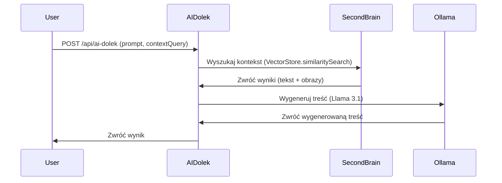

# AIDolek - Generator Treści z Kontekstem Multimodalnym

## Opis
AIDolek to mikroserwis generujący spersonalizowane treści (LinkedIn, email, blog) na podstawie:
- **Promptu użytkownika**.
- **Kontekstu z Second Brain** (tekst + obrazy).

## Endpoint
### `POST /api/ai-dolek`

#### Parametry
| Parametr      | Typ     | Wymagany | Opis                                                                 |
|---------------|---------|----------|---------------------------------------------------------------------|
| `prompt`      | string  | Tak      | Zadanie dla AI (np. "Napisz post o lokalnym AI").                 |
| `platform`    | string  | Tak      | Platforma docelowa: `linkedin`, `email`, `blog`.                    |
| `useContext`  | boolean | Nie      | Czy użyć kontekstu z Second Brain? (domyślnie: `false`).             |
| `contextQuery`| string  | Nie*     | Zapytanie do wyszukiwania w Second Brain (tekst lub ścieżka obrazu).|
| `contextType` | string  | Nie      | Typ kontekstu: `text` (domyślnie) lub `image`.                      |
| `tone`        | string  | Nie      | Ton treści: `formal`, `casual` (domyślnie), `technical`.            |

*Wymagany, jeśli `useContext=true`.

#### Przykłady
##### 1. Generowanie bez kontekstu
```bash
curl -X POST http://localhost:3000/api/ai-dolek \
  -H "Content-Type: application/json" \
  -d '{
    "prompt": "Napisz post na LinkedIn o korzyściach z lokalnego AI",
    "platform": "linkedin"
  }'
```

##### 2. Generowanie z kontekstem tekstowym
```bash
curl -X POST http://localhost:3000/api/ai-dolek \
  -H "Content-Type: application/json" \
  -d '{
    "prompt": "Napisz email o Second Brain na podstawie dokumentacji",
    "platform": "email",
    "useContext": true,
    "contextQuery": "Second Brain",
    "contextType": "text"
  }'
```

##### 3. Generowanie z kontekstem obrazu
```bash
curl -X POST http://localhost:3000/api/ai-dolek \
  -H "Content-Type: application/json" \
  -d '{
    "prompt": "Napisz post o architekturze systemu na podstawie diagramu",
    "platform": "linkedin",
    "useContext": true,
    "contextQuery": "diagram.png",
    "contextType": "image"
  }'
```

## Architektura
### Przepływ danych


### Obsługa multimodalności
- **Tekst**: Przekazywany bezpośrednio do promptu (`pageContent`).
- **Obrazy**: Reprezentowane jako `[Obraz: nazwa.png]` z opcjonalnym opisem (`metadata.description`).

## Wymagania
- **Second Brain**: Musi być uruchomiony (Redis + FAISS).
- **Ollama**: Lokalny model Llama 3.1 (`llama3.1:8b`).