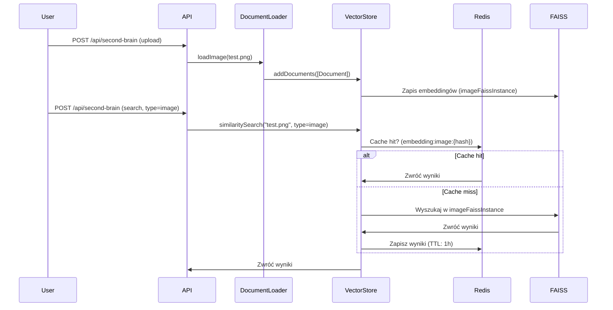

# Second Brain API (Multimodal)

## Endpointy
### `POST /api/second-brain`

#### Parametry
| Parametr | Typ     | Wymagany | Opis                                                                 |
|----------|---------|----------|---------------------------------------------------------------------|
| `action` | string  | Tak      | Akcja do wykonania: `search`, `upload`, `search-with-score`.        |
| `query`  | string  | Tak*     | Zapytanie do wyszukiwania (tekst lub ścieżka do obrazu).            |
| `type`   | string  | Nie      | Typ wyszukiwania: `text` (domyślnie) lub `image`.                   |
| `files`  | File[]  | Nie      | Pliki do uploadu (PDF/TXT/obrazy).                                  |

*Wymagany tylko dla `action=search` lub `action=search-with-score`.

#### Przykłady
##### 1. Wyszukiwanie tekstu
```bash
curl -X POST http://localhost:3000/api/second-brain \
  -F "action=search" \
  -F "query=Jak działa Second Brain?"
```

##### 2. Wyszukiwanie obrazów
```bash
curl -X POST http://localhost:3000/api/second-brain \
  -F "action=search" \
  -F "query=test.png" \
  -F "type=image"
```

##### 3. Upload plików
```bash
curl -X POST http://localhost:3000/api/second-brain \
  -F "action=upload" \
  -F "files=@test.png" \
  -F "files=@dokument.pdf"
```

## Architektura
### Komponenty
1. **DocumentLoader** (`src/lib/documentLoader/documentLoader.ts`)
   - Ładuje dokumenty (PDF/TXT) i obrazy (PNG/JPG).
   - Dla obrazów generuje embeddingi za pomocą CLIP (`Xenova/clip-vit-base-patch32`).

2. **VectorStore** (`src/lib/vectorStore.ts`)
   - Przechowuje embeddingi w FAISS (osobne indeksy dla tekstu i obrazów).
   - Cache'uje wyniki wyszukiwania w Redis (klucz: `embedding:{type}:{hash}`).

3. **ImageEmbeddings** (`src/lib/imageEmbeddings.ts`)
   - Generuje embeddingi dla obrazów za pomocą CLIP.

### Schemat przepływu danych
