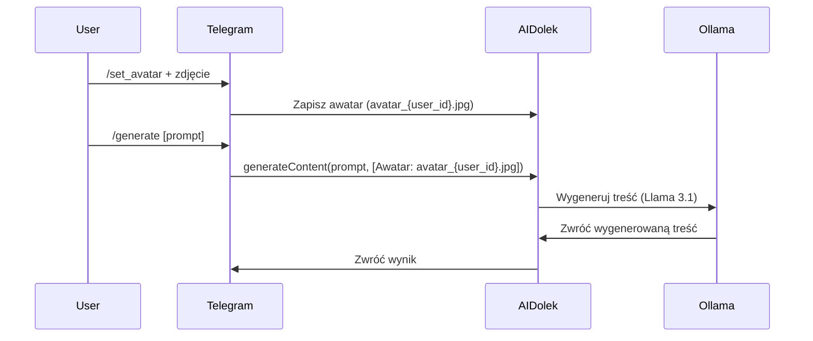

# Telegram Bot dla AIDolek

## Opis
Bot umożliwia:
- **Zapisywanie awatarów AI** (komenda `/set_avatar`).
- **Generowanie treści** z wybranym awatarem (komenda `/generate`).

## Komendy
| Komenda       | Opis                                                                 |
|---------------|---------------------------------------------------------------------|
| `/start`      | Wyświetla powitanie i listę komend.                                  |
| `/set_avatar` | Ustawia wysłane zdjęcie jako awatar AI.                              |
| `/generate`   | Generuje treść na podstawie promptu (z wybranym awatarem).          |

## Przykłady użycia
### 1. Ustawienie awatara
1. Wyślij `/set_avatar`.
2. Wyślij zdjęcie (awatar zostanie zapisany jako `avatar_{user_id}.jpg`).

### 2. Generowanie treści
```
/generate Napisz post na LinkedIn o korzyściach z lokalnego AI
```

## Architektura
### Przepływ danych


### Struktura plików
- **Awatary**: Zapisywane w `avatars/avatar_{user_id}.jpg`.
- **Prompty**: Informacja o awatarze jest dodawana do promptu jako `[Awatar: nazwa.jpg]`.

## Wymagania
- **Token bota**: Ustaw `TELEGRAM_BOT_TOKEN` w zmiennych środowiskowych.
- **Katalog `avatars/`**: Musi istnieć i być zapisywalny.
- **AIDolek**: Musi być uruchomiony (endpoint `/api/ai-dolek`).